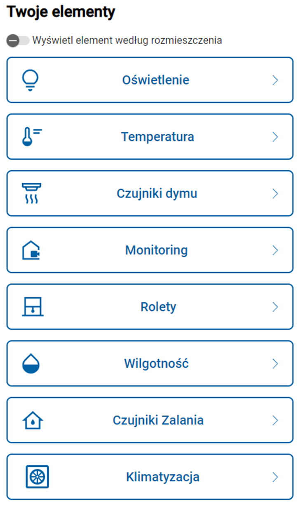
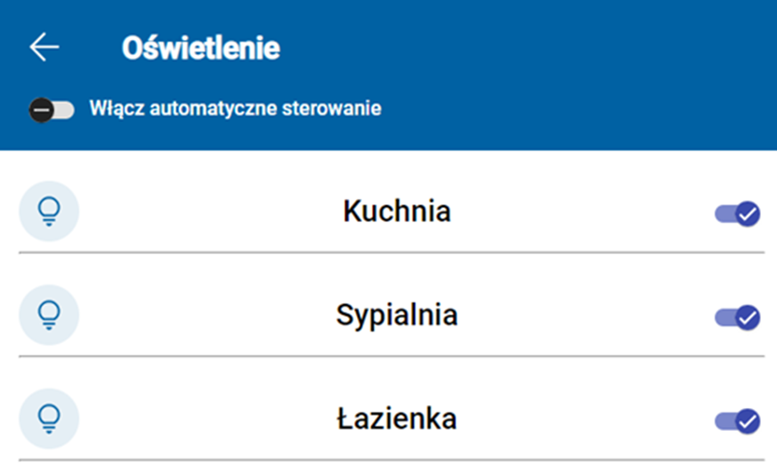
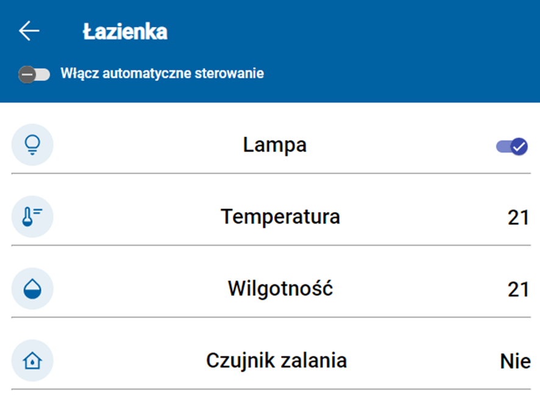
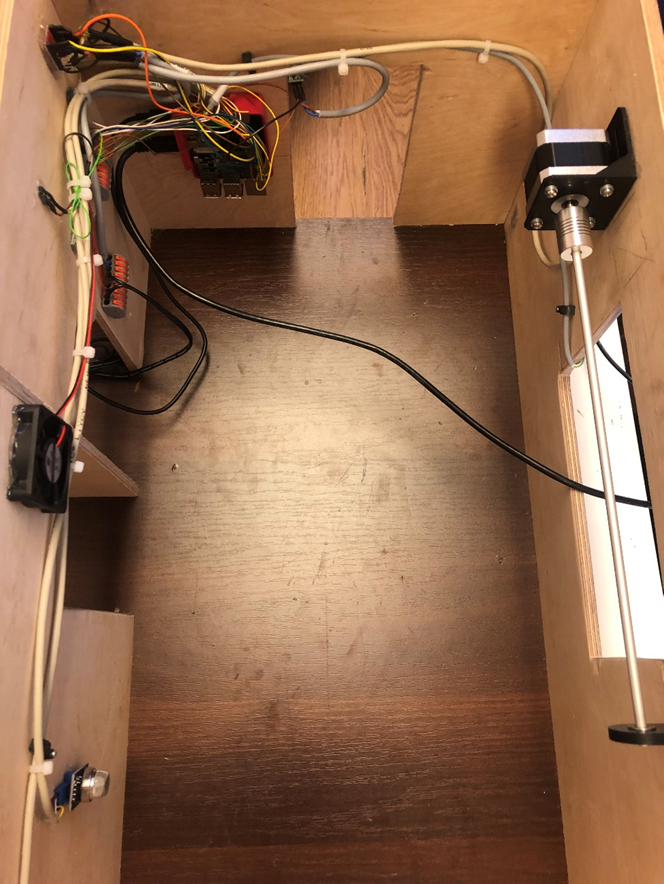

# Projekt miniSmartHome

> Aplikacja webowa wykorzystująca Angulara i Express.js sterująca elementami eletronicznymi za pomocą raspberry pi

## Informacje ogólne

- Projekt domyślnie służy do sterowania elementami elektronicznymi wykorzystując raspberry pi
- Aplikacja służyła do prezentacji działania makiety mieszkania ze zdalnym sterowaniem elementami takimi jak: światło, silnik krokowy sterujący roletą, odczyt parametrów z czujników itd.
- Jest to aplikacja treningowa, nie mająca zasotowania przemysłowego ale będzie rozwijana w przyszłości o elementy ML.

## Używane technologie

- Angular 15.0
- Typescript 4.9
- MongoDB 4.2
- Express.js 4.18
- pigpio 3.3.1 4.8
- python

## Screenshots

## Setup

W celu uruchomienia projektu należy odpalić na systemie linuxowym (najlepiej bezpośrednio na Raspianie korzystając z Raspberry pi) npm install w folderze głównych oraz folderze server aby zaktualizowały się node.modules

## W przyszłości

To do:

- Dodanie systemu wykrywania twarzy
- Autentykacja i autoryzacja
- Nauka zwyczajów użytkowników aby AI mogło dostosowywać układ elementów do zachowań użytkowników

Created by [@Kisowskii]
